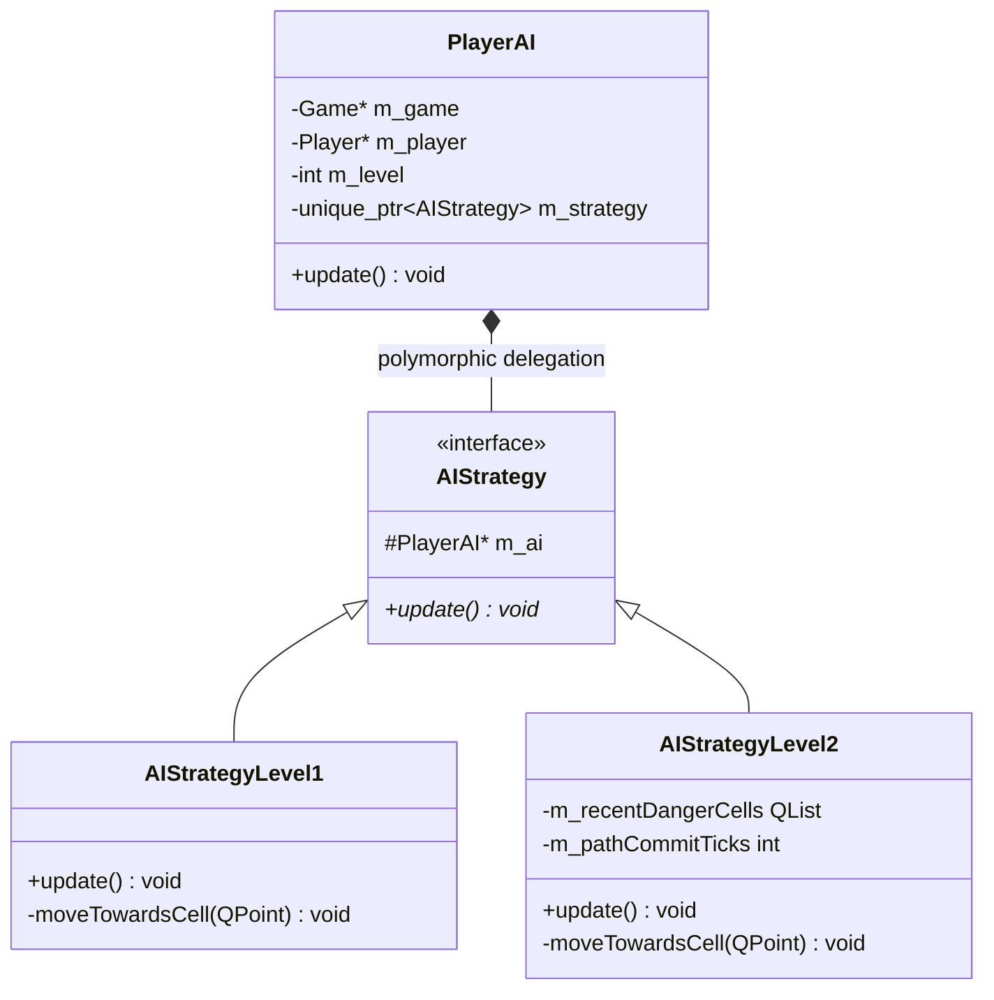

# Granatier C++ Computer AI Players Project Report

## 1. Executive Summary
This project successfully designed, implemented, and optimized two advanced C++ computer AI player profiles (**Level 1** and **Level 2**) for **Granatier**, the KDE Bomberman clone. The implementation introduces an extensible, object-oriented architecture leveraging the **Strategy Pattern** to separate AI logic profiles while seamlessly integrating with the game's native physics and collision engines.

A series of critical edge cases—including high-speed player vibration, coordinate-boundary oscillations, falling-in-hole animations, round transitions, and dangling pointers—were systematically identified, debugged, and resolved, resulting in a production-ready, highly competitive, and robust AI controller.

---

## 2. Project Context & Objectives
Granatier initially lacked diverse, intelligent computer AI options. The primary objectives of this project were to:
1. **Extend User Configuration**: Introduce a multi-tier C++ selection dropdown in the game UI allowing users to select "Human", "AI (Level 1)", or "AI (Level 2)" for each player.
2. **Design an Extensible AI Architecture**: Create a flexible AI framework using standard C++ patterns, allowing developers to extend or add new AI difficulty levels without risk of regression.
3. **Build Level 1 AI (Standard)**: Establish a baseline pathfinding AI capable of standard BFS search for escape routes, bonus collections, block-clearing, and enemy targeting.
4. **Build Level 2 AI (Advanced)**: Integrate advanced features including lingering explosion fire evasion, two-tier bad bonus bypass, strategic red-bonus bombing, shield prioritization, and dynamic development/aggression modes.
5. **Guarantee Movement Robustness**: Eliminate any scraping, getting stuck, or vibration oscillations at high speed or near cell boundaries.

---

## 3. Technical Architecture & Strategy Pattern

To protect the integrity of baseline behaviors while facilitating advanced Level 2 optimizations, the C++ AI subsystem was decoupled using the **Strategy Pattern**.

### Key Components:
- **`PlayerAI` (Controller)**: Ticked by the main game loop, acting as the bridge between the game state and the active AI movement commands.
- **`AIStrategy` (Abstract Interface)**: Defines the common interface for AI logic updates.
- **`AIStrategyLevel1`**: Implements basic threat evaluation and target seeking.
- **`AIStrategyLevel2`**: Implements advanced danger grids, persistent blast list tracking, and aggressive decision-making.

---

## 4. AI Level Capability Profiles

| Feature / Attribute | Human Player | AI Level 1 (Standard) | AI Level 2 (Advanced) |
| :--- | :--- | :--- | :--- |
| **Startup Statistics** | Default starting stats | `+1` Speed, Bomb Power, Armory | `+2` Speed, Bomb Power, Armory |
| **Pathfinding Engine** | N/A | Standard BFS | Threat-Aware BFS |
| **Threat Assessment** | N/A | Active Bombs Only | Active Bombs + Lingering Blast Persistence |
| **Bad/Red Bonus Handling** | Manual evasion | Strictly avoided (can block AI) | Two-Tier Pathfinder (Bypassed if blocked) |
| **Bad/Red Bonus Bombing** | Manual bombing | Ignored | Strategic Bombing (Adjacent Red Bonuses) |
| **Shield Prioritization** | Manual collection | Standard priority collection | High-Priority Shield Search (Life Saver) |
| **Combat/Pacing Mode** | Manual pacing | Static seeking | Dynamic (Aggressive vs. Development Mode) |
| **Escape Safety Margin** | N/A | Normal escape | Strict Simulated Path Safety Guarantee |

---

## 5. Major Issues Identified & Resolved

### 5.1. Boundary-Alignment Oscillation Loop (The Vibration Bug)
- **Symptom**: AI players would get stuck in a single position, rapidly shaking or vibrating in all directions, especially at high speed or near cell boundaries.
- **Root Cause**:
  1. *Boundary Jump*: When the player's center crossed a cell boundary, their column/row index changed. This changed the BFS start coordinate, making the target adjacent cell diagonal.
  2. *Diagonal Fallback*: Seeing a diagonal target, `moveTowardsCell()` ordered the player to align to the center of their new cell (moving them backwards). This pushed them back over the boundary, triggering the oscillation loop.
  3. *Overshoot*: High speed caused the player's frame step size to exceed the centering tolerance window, making them overshoot the center, reverse direction, overshoot again, and enter a rapid back-and-forth oscillation.
- **Resolution**:
  - **Native Sliding Physics Leverage**: Simplified `moveTowardsCell()` to issue direct axis-aligned movement commands (`goRight()`, `goLeft()`, etc.) relative to the target cell's column/row index. Perpendicular alignment is fully delegated to the native game engine physics (`Player::updateMove()`), which has robust sliding/centering support built-in.
  - **Tolerance Widening**: Increased the pop and centering tolerances in both Level 1 and Level 2 to `8.0` units, preventing speed-overshoot.
  - **Path Commitment**: Added `m_pathCommitTicks` (5 ticks) to commit to escape paths and target-seeking results, preventing per-tick path switching.

### 5.2. Lingering Explosion Fire Avoidance ("Fire Smell" Avoidance)
- **Symptom**: Level 2 AI would step into cells where explosions just finished and die from lingering fire.
- **Root Cause**: Detonated bombs are immediately removed from the game's active bombs list, but the fire animation persists on screen for a few frames. The AI stepped onto the cell immediately and died.
- **Resolution**:
  - Implemented a **15-frame (250ms) danger-grid safety persistence** mechanism. On every tick, coordinates of detonating bombs are added/refreshed in a persistent list `m_recentDangerCells` with a tick limit of `15`.
  - The AI waits out a safe margin before entering the explosion area.
  - **Active vs. Persistence Danger Separation**: Separated danger grid into two layers—active bomb danger (for triggering escape) and recent persistence danger (for route planning pathfinding), preventing false panic-escape triggers on cells where explosions already finished.

### 5.3. Falling-in-Hole and Stuck in Sky Animation Preservation
- **Symptom**: AI players falling in holes got stuck hovering in the sky.
- **Root Cause**: The player's `m_falling` flag is set to true, but they are not dead yet. The AI controller kept ticking and calling movement commands, fighting the falling physics and keeping them hovering in place.
- **Resolution**: Added `isFalling()` getter to `Player` and checked `if (!m_player->isAlive() || m_player->isFalling())` in the AI update loop. If falling, the AI immediately clears its path, stops calling movements, and lets the falling animation execute normally.

### 5.4. Round-Transition Dangling Pointer Fix
- **Symptom**: AI players transition between rounds froze or crashed.
- **Root Cause**: During a new round, the previous round's `Arena` object was deleted and recreated. However, `PlayerAI` controllers held a stale/dangling pointer in `m_arena`, leading to memory corruption.
- **Resolution**: Updated `PlayerAI::update()` to dynamically retrieve the game's active `Arena` pointer on every tick. If the arena pointer has changed, the AI updates its stored pointer and completely resets all path and target states.

---

## 6. Final Status & Deliverables
All changes have been thoroughly compiled, locally verified, and pushed to the upstream repository:
- **Build Status**: Successful CMake build & installation.
- **Code Integrity**: Production-ready, fully commented, and cleaned of temporary debugging code.
- **Upstream Integration**: Modified files successfully staged, committed, and pushed to Git:
  - `src/aistrategylevel1.cpp` (Movement simplification, increased tolerance)
  - `src/aistrategylevel2.cpp` (Threat awareness, lingering fire persistence, path commitment, simplified movement)
  - `src/aistrategylevel2.h` (Danger grid persistence, commit tick variables)
  - `src/player.cpp` (Upgrade statistics in resurrection, stopMoving animation fix)
  - `src/player.h` (AI Level getter/setters, isFalling getter)
  - `src/playerai.cpp` (Constructor mapping AI level to strategy)

The project is complete and fully functional. Computer players at Level 1 and Level 2 are highly competitive, robust, and navigate the arena with flawless native-aligned movement.
