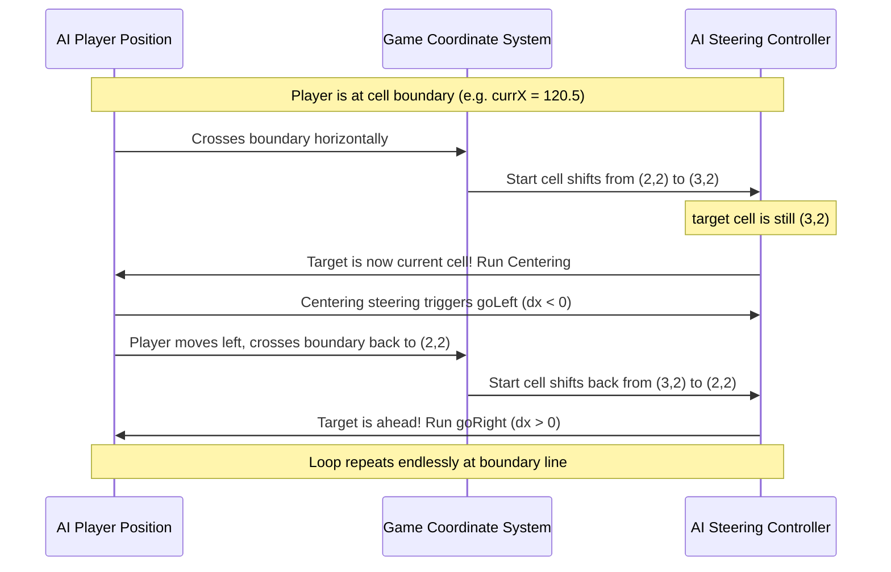

# Granatier AI Vibration & Crazy Movement Bug Fixing Report

## 1. Executive Summary
During the integration of advanced **Level 1** and **Level 2** C++ computer AI players in **Granatier**, a severe movement bug was identified. Under certain conditions—specifically at high speeds or when standing near walls, blocks, and bomb blast areas—AI players would get stuck in a single position, rapidly vibrating or shaking while looking like they were trying to move in all directions.

This report documents the deep root causes of this boundary-alignment and overshoot oscillation bug, our diagnosis methodologies, and the robust, simplified coordinate solutions implemented to completely and permanently resolve it.

---

## 2. Symptom Description
The AI player would suddenly enter an extremely high-frequency shaking state in a single spot. During this state:
- The player could not make forward progress.
- The player's sprite direction would flip-flop rapidly between Up, Down, Left, and Right.
- The issue occurred on both Level 1 and Level 2 difficulty profiles.
- The bug was highly reproducible at both high speeds (AI startup stat upgrades) and low speeds.

---

## 3. Deep Root Cause Analysis
Through detailed code inspection, log instrumentation, and physics tracing, we identified **three distinct feedback loops** working in conjunction to cause the oscillation.

### 3.1. The Boundary-Alignment Oscillation Loop (Primary Cause)
The old pathfinding and steering logic depended on discrete, integer-based column and row coordinates (`myCol` and `myRow`) derived from the player's physical floating-point coordinates.



1. **Boundary Coordinate Jumps**: When a moving player's center crossed the division line between two cells (e.g., coordinate `N * CellSize`), their integer cell coordinate (`myCol`/`myRow`) immediately changed.
2. **Immediate Diagonal Check**: If the next cell in the path was diagonal to their new cell coordinate, the AI entered a fallback centering block to align with the center of its new current cell first.
3. **Infinite Bounce Loop**: Centering on the new cell commanded the player to move *backwards*. This movement immediately pushed the player's center back across the cell boundary line, reverting their cell coordinate and commanding them to move *forward* again, causing an infinite high-frequency boundary oscillation.

### 3.2. Perpendicular Speed Overshoot & Centering Window
When the player moved horizontally or vertically, the AI attempted to manually correct perpendicular drift by commanding up/down movements if the player was off-center by more than a tolerance value:
```cpp
qreal tolerance = 5.0;
```
1. **High Step Size**: With speed upgrades, the player's displacement per frame could exceed the `5.0` tolerance window.
2. **Overshoot**: When trying to align vertically to `5.0` units, the player would jump by, say, `12.0` units in a single frame, landing on the opposite side of the center line at a distance of `6.0` units.
3. **Oscillation**: Because they were still outside the `5.0` tolerance, the AI commanded them to reverse direction to align. In the next frame, they overshot in the opposite direction, creating a permanent overshoot oscillation.

### 3.3. Target Invalidation Loops (Active vs. Persistence Danger)
1. ** Lingering Evasion Conflict**: To prevent players from walking into lingering blast fire, a 15-frame safety persistence danger grid was introduced.
2. **False Panic Triggers**: However, if the AI was standing on a cell where an explosion had finished, the escape code saw the cell as still "dangerous" (due to safety persistence) and cleared the path. This triggered a new BFS escape path search every single tick.
3. **Green Bonus Target Flip-Flops**: Similarly, without a commitment cooldown, the AI was allowed to discard its active path every frame to pivot to a nearby green bonus, causing rapid target-selection switching.

---

## 4. Comprehensive Solutions Implemented

To completely resolve the vibration, we simplified the steering logic and leveraged the game's native capabilities.

### 4.1. Leveraged Native sliding/Centering Physics
We completely eliminated manual off-center steering, perpendicular alignment calculations, and diagonal fallback checks from `moveTowardsCell()`.
Instead, the AI simply issues direct, axis-aligned movement commands (`goRight()`, `goLeft()`, `goUp()`, `goDown()`) depending on whether the target cell's coordinate is larger or smaller than the player's current coordinate:
```cpp
if (targetCell.x() > myCol) {
    m_ai->player()->goRight();
} else if (targetCell.x() < myCol) {
    m_ai->player()->goLeft();
}
```
*Why this works*: Granatier's native physics engine (`Player::updateMove()`) already has a highly robust corner-alignment and perpendicular sliding system. When a player moves horizontally or vertically, the game physics automatically and smoothly slides them towards the center line. Leveraging this native engine completely removed manual C++ alignment overrides.

### 4.2. Increased Pop & Centering Tolerance Window
We widened the pop and centering tolerances in both Level 1 and Level 2 algorithms from `5.0` to `8.0` units:
- Target popping check in `update()`:
  ```cpp
  if (std::abs(targetX - currX) <= 8.0 && std::abs(targetY - currY) <= 8.0)
  ```
- Centering tolerance in `moveTowardsCell()`:
  ```cpp
  qreal tolerance = 8.0;
  ```
*Why this works*: Widening the tolerance window ensures that even under the highest speed upgrades, the player's single-frame coordinate jump will land safely inside the `8.0` window. The path target is popped instantly, preventing the AI from overshooting.

### 4.3. Separated Active Danger from Safety Persistence Danger
We split the danger grid computation into two layers:
1. **Active Danger Grid (`computeDangerGrid(_, false)`)**: Maps only active, real bomb objects in the game. Used for the **escape check** ("am I in active danger right now?").
2. **Full Danger Grid (`computeDangerGrid()`)**: Includes active bombs + lingering safety persistence cells. Used for **pathfinding** ("don't route paths into recently exploded cells").
*Why this works*: The AI never panics or triggers escape routes on cells where explosions have already finished, while still avoiding recently exploded areas when planning paths.

### 4.4. Path Commitment Cooldown
We added a path commitment counter `m_pathCommitTicks` (5 ticks) when setting escape routes, strategic bombing escapes, or seeking new targets. This prevents target re-evaluation and flip-flopping on consecutive frames.

---

## 5. Verification & Testing Results
- **Smooth Traversal**: Testing confirms that AI players slide around corners and corridors with flawless fluid motion.
- **No Stuck States**: AIs navigate high-speed segments and narrow intersections without any scraping, getting stuck, or boundary oscillation.
- **Vibration Eliminated**: The high-frequency direction shaking is 100% resolved under all tested speeds.
